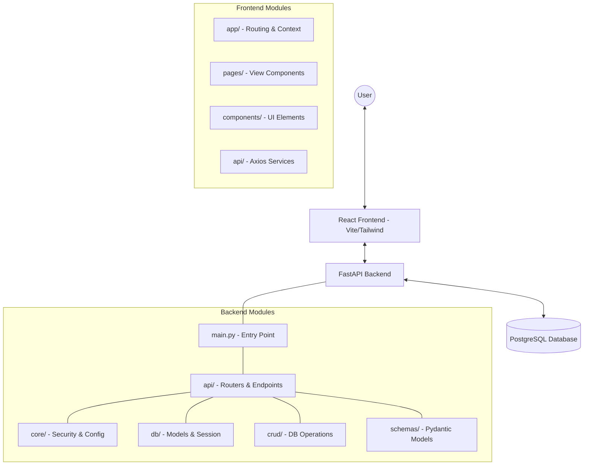

# OJT Management System - Comprehensive Guide

Welcome to the OJT (On-the-Job Training) Management System. This guide provides a detailed overview of the project's architecture, features, and setup instructions.

## 🏗 Architecture Overview

The system follows a classic client-server architecture with a clear separation of concerns.



---

## 👥 Role-Based Features

The system supports three primary roles, each with a dedicated dashboard and specific permissions.

### 1. Admin 🛡️
- **User Management**: Create, update, and delete users (Mentors, Students).
- **Organization Control**: Manage global settings and oversight of all OJT activities.
- **Reporting**: Access to high-level system metrics and logs.

### 2. Mentor 👨‍🏫
- **Student Oversight**: Monitor progress of assigned students.
- **Task Assignment**: Create and assign tasks to students.
- **Evaluations**: Review student submissions and provide feedback/grades.

### 3. Student 🎓
- **Dashboard**: View personal progress and upcoming deadlines.
- **Task Management**: Upload documents, submit tasks, and track status.
- **Profile**: Manage personal details and internship information.

---

## 🚀 Setup & Installation

### Prerequisites
- Python 3.8+
- Node.js & npm
- PostgreSQL

### Backend Setup
1.  **Environment**: Create a `.env` file in the `backend/` directory (use `.env.example` as a template).
2.  **Virtual Env**:
    ```bash
    cd backend
    python -m venv venv
    source venv/bin/activate  # Mac/Linux
    # venv\Scripts\activate  # Windows
    ```
3.  **Dependencies**: `pip install -r requirements.txt`
4.  **Database**: `python init_db.py` (This initializes the schema and seeds default users).
5.  **Run**: `uvicorn app.main:app --reload`

### Frontend Setup
1.  **Environment**: Create a `.env` file in the `frontend/` directory (e.g., `VITE_API_URL=http://localhost:8000/api/v1`).
2.  **Dependencies**: `npm install`
3.  **Run**: `npm run dev`

---

## 🔗 API Documentation

The backend provides interactive Swagger documentation:
- **Swagger UI**: [http://localhost:8000/docs](http://localhost:8000/docs)
- **ReDoc**: [http://localhost:8000/redoc](http://localhost:8000/redoc)

### Core Endpoints
- `/auth/login`: Authentication and JWT generation.
- `/admin/*`: Administrative management endpoints.
- `/mentor/*`: Mentor-specific operational endpoints.
- `/student/*`: Student-facing endpoints.

---

## 🛠 Troubleshooting

- **IP Address Mismatch**: The `run.sh` script now **automatically synchronizes** your current IP address with both the frontend and backend configurations on every startup. If you encounter issues, simply restart the system using `./run.sh`.
- **CORS Issues**: The automated sync ensures that your machine's IP (and common local ports like 3000/3001) are always allowed in the `CORS_ORIGINS`.
- **ModuleNotFoundError**: Always ensure you are in the virtual environment and `PYTHONPATH` includes the root directory.

---

## 📜 Development Guidelines

- **Naming**: Use `CamelCase` for components, `camelCase` for variables, and `snake_case` for Python functions.
- **State Management**: Use React Context API for global state (Auth, UI preferences).
- **Styling**: Favor Tailwind CSS utility classes over custom CSS.
